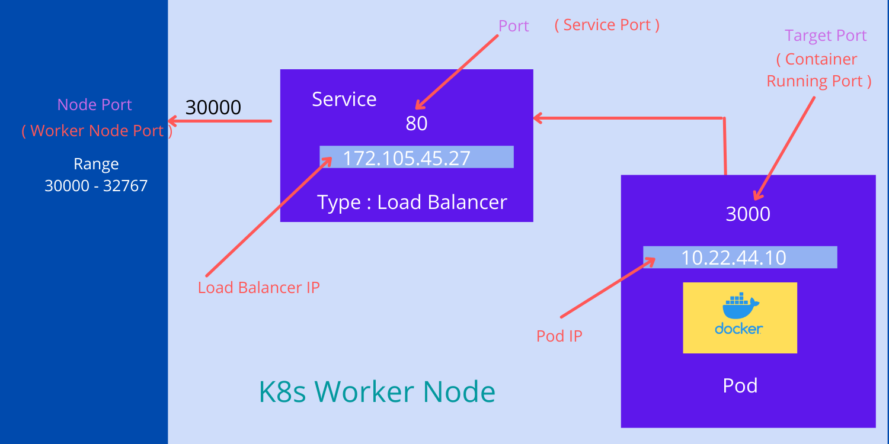
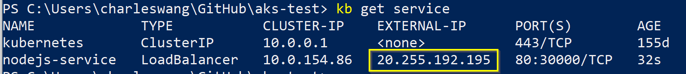

# aks-test

## Exercise 1
```
alias kb="kubectl"
kb create -f .\my-first-pod.yaml
kb get pod
kb describe pod my-pod
kb port-forward my-pod 8000:3000
kb expose pod my-pod --type=NodePort --name=my-pod-service
kb get service
kb attach my-pod -i
kb exec my-pod -- ls /app
kb get pod --show-lables
kb label pods my-pod version=latest
kb run -i --tty alpine --image=alpine --restart=Never -- sh
/ # apk add --no-cache curl
/ # curl http://10.244.1.12:3000
/ # cat /etc/resolv.conf
kb apply -f .\my-first-pod-service.yaml
curl http://20.239.120.250/ (will show Hello World!)
```

## Exercise 2
```
kb run php-pod --image php:8-apache
kb logs php-pod
kb run nodejs-pod --image bharathirajatut/erp:1.0
```

## Exercise 3


```
kb apply -f .\nodejs-pod.yaml
kb apply -f .\nodejs-service.yaml
kb describe pod nodejsapp-pod | Select-String app=
curl http://20.255.192.195/get-data (will show {"message":"Get JSON Example"})
curl http://20.255.192.195/ (will show {"message":"Root page"})
```

## Reference
1. [Kubernetes 30天學習筆記系列 第 5 篇](https://ithelp.ithome.com.tw/articles/10193232)

2. [Create A Pod In Kubernetes Cluster](https://medium.com/codex/create-a-pod-in-kubernetes-cluster-b9e0c33bb904)

3. [Access Application Externally In Kubernetes Cluster using Load Balancer Service](https://medium.com/codex/access-application-externally-in-kubernetes-cluster-using-load-balancer-service-d1b7858d51)