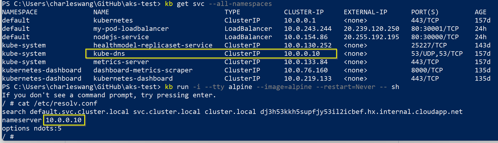

# aks-test

## Exercise 1
```
alias kb="kubectl"
kb create -f .\my-first-pod.yaml
kb get pod
kb describe pod my-pod
kb port-forward my-pod 8000:3000
kb expose pod my-pod --type=NodePort --name=my-pod-service
kb get service
kb attach my-pod -i
kb exec my-pod -- ls /app
kb get pod --show-lables
kb label pods my-pod version=latest
kb run -i --tty alpine --image=alpine --restart=Never -- sh
/ # apk add --no-cache curl
/ # curl http://10.244.1.12:3000
/ # cat /etc/resolv.conf
kb apply -f .\my-first-pod-service.yaml
curl http://20.239.120.250/ (will show Hello World!)
```

## Exercise 2
```
kb run php-pod --image php:8-apache
kb logs php-pod
kb run nodejs-pod --image bharathirajatut/erp:1.0
```

## Exercise 3


```
kb apply -f .\nodejs-pod.yaml
kb apply -f .\nodejs-service.yaml
kb describe pod nodejsapp-pod | Select-String app=
curl http://20.255.192.195/get-data (will show {"message":"Get JSON Example"})
curl http://20.255.192.195/ (will show {"message":"Root page"})
```

## Reading 4

在 Master Node 上有著四種不同的元件：etcd，Controller Manager，Scheduler 與 API Server

### Etcd
當我們在終端機輸入上述指令後，kubectl 的請求會送往 Kubernetes Cluster 中的 Master Node。Master 中的 API Server 接收到該請求之前，會先經過一層認證(authorization)，確認傳送方的身份沒問題後，再將這個請求傳遞給 Master Node 中的 API Server， API Server 每次收到指令後，會先把每個接收到的請求內容存放在 etcd 中。

在 Kubernetes 中，etcd 用來存放 Cluster 中所有的 data。當 master nodes 因為某些原因而故障時，我們可以透過 etcd 幫我們還原 Cluster 的狀態。通常在實際場景中，我們偏好使用 Multi-node etcd cluster 勝過單一的 etcd，以防 etcd 節點本身也故障的狀況發生。以 Kubernetes 為例，官網建議 3 或 5 個的節點作為 etcd cluster。

### Controller Manager
Controller Manager 是 Kubernetes 中所有 Controllers 的核心管理者。Controller Manager 會定期去訪問 API Server，若有接收到變更的指令 Controller Manager 則會去更改這些 Controllers 的狀態。

以上述 kubectl create ... 為例，Controller Manager 從 API Server 那邊得知需要創建一個新的 hello-pod 物件後會先經過一連串的檢查。在資源都許可的狀況下，Controller Manager 會建立一個新的 Pod 物件。

### Scheduler
除了 Controller Manager, Master Node 上的 Scheduler 也會定期去訪問 API Server。若發現 Controller Manager 有新建置的 Pod 物件時，會負責將這些 Pod 安置在某一個 Node 上。每個 Node 裡面都會有一個 kubelet，kubelet 相當於 node agent，做為 master node 與 node 即時溝通的橋樑。因此，API Server 保有每個 Node 目前的最新狀況，而 Scheduler 可以根據 API Server 上每個 Node 目前的狀況，透過特定的調度邏輯將 Pod 放置在最適合的 Node 上。

## Reading 5

每個 Node 都有屬於它自己的 iptables，iptables 是 Linux 上的防火牆 (firewall)，不只限制哪些連線可以連進來，也會管理網路連線，決定收到的 request 要交給哪個 pod。

由於每個Pod中有自己的網路。所以同一個 Pod 中 的containers 之間可以透過 <localhost:port_num> 互相溝通。而這樣無需透過外網的性質，讓我們可以將性質相近的服務放在同一個Pod裡，好比一個後端 API service，與一個後端認證service，可以放在同一個 pod 裡互相溝通。

### kubelet
kubelet相當於 node agent，用於管理該 Node 上的所有 pods以及與 master node 即時溝通。

### kube-proxy
kube-proxy 則是會將目前該 Node 上所有 Pods 的資訊傳給 iptables，讓 iptables 即時獲得在該 Node 上所有 Pod 的最新狀態。好比當一個 Pod物件 被建立時，kube-proxy 會通知 iptables，以確保該 Pod 可以被 Kubernetes Cluster 中的其他物件存取。

### 當我們創建一個新的 Pod 後，收到使用者發送的 request 時，ks8 內部會發生什麼事呢?
首先，kubelet 會先收到 master node 指令，創建一個 Pod。創建好後，kube-proxy 會去告知 iptables，目前該 Pod 可用。

當使用者透過網路 (Internet) 發送 requests 時，requests 會先送到 Load Balancer，由 Load Balancer 決定要把 request 交給哪個 Node，這時收到 requests 的 Node 會經由 iptables 決定要送給哪個 Pod 。

但如果收到 request 的 Node 恰好沒有相對應可以處理 request 的 Pod 話，原本收到 request 的 Node 會透過 iptables 把 request 轉給其他有可以處理這個 request 的 Node 。

## Reading 6
什麼是 Service？Service的用途有哪些？

### ClusterIp
Kubernetes Cluster 中的其他服務，可以透過這個 ClusterIp 訪問到正在運行中的 Pods。在每次創建 Service 物件時，Kubernetes 就會預設一組 virtual IP 給 Service 物件。除非我們在 Service yaml 指定想要的 virtual IP，否則 Kubernetes 每次都會隨機指定一組virtual IP。

### NodePort
Kubernetes Cluster 外但在同一個 Node 上的其他服務，可以透過這個 NodePort 訪問到 Kubernetes Cluster 內正在運行中的 Pods。

### LoadBalancer
可以透過 cloud provider 提供的 LoadBalancer ，幫我們分配流量到每個 Node。

## Reading 7
Kubernetes 在每一個 Pod 創建時，都會在該 Pod 的 /etc/resolve.conf 檔案中，自動加入 kube-dns service 的 domain name 與相對應的 IP 位址。因此 其他 Pods 可以透過名稱為 kube-dns 的 Service 物件，找到正在運行的 kube-dns


## Reference
1. [Kubernetes 30 天學習筆記系列 第 5 篇](https://ithelp.ithome.com.tw/articles/10193232)

2. [Create A Pod In Kubernetes Cluster](https://medium.com/codex/create-a-pod-in-kubernetes-cluster-b9e0c33bb904)

3. [Access Application Externally In Kubernetes Cluster using Load Balancer Service](https://medium.com/codex/access-application-externally-in-kubernetes-cluster-using-load-balancer-service-d1b7858d51)

4. [Kubernetes 30 天學習筆記系列 第 29 篇](https://ithelp.ithome.com.tw/articles/10197442)

5. [Kubernetes 30 天學習筆記系列 第 6 篇](https://ithelp.ithome.com.tw/articles/10193248)

6. [Kubernetes 30 天學習筆記系列 第 9 篇](https://ithelp.ithome.com.tw/articles/10194344)

7. [Kubernetes 30 天學習筆記系列 第 17 篇](https://ithelp.ithome.com.tw/articles/10195786)